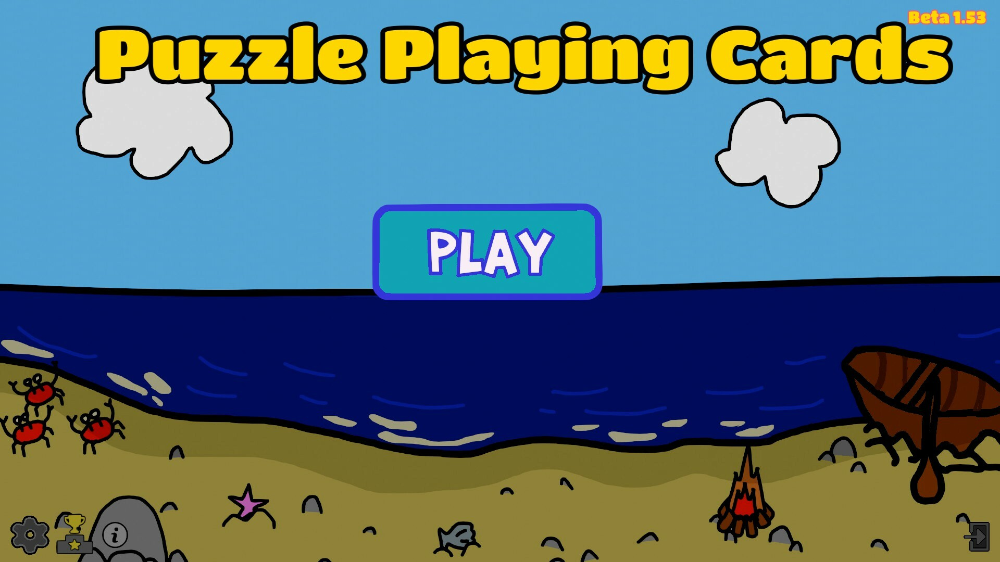

# Puzzle Playing Cards
Puzzle Playing Cards is an interactive card game where players try to collect puzzle pieces to complete individual puzzles of a specific theme. Each player aims to collect 4 puzzle pieces of a specific set to score points. Each card represents one quarter of the puzzle and contains both visual and informational content.
 The Game Incorporates
<ul>
  <li>Card management</li>
  <li>Multipler mechanics</li>
  <li>Single player mechanices</li>
  <li>Rank/ELO Progression</li>
  <li>Configurable match making system</li>
  <li>Wild Cards</li>
  <li>Achievements</li>
  <li>Leaderboards</li>
  <li>Chat & Emotes</li>
</ul>
 This project was developed as a fully playable commercial Steam release and was designed as the test pilot for the long-term platform expansion, planned for educational integrations and repository-based deck systems

# Gameplay Media

