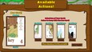
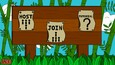
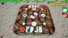
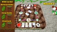
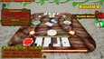

# Puzzle Playing Cards
Puzzle Playing Cards is an interactive card game where players try to collect puzzle pieces to complete individual puzzles of a specific theme. Each player aims to collect 4 puzzle pieces of a specific set to score points. Each card represents one quarter of the puzzle and contains both visual and informational content.
 The Game Incorporates
<ul>
  <li>Card management</li>
  <li>Multipler mechanics</li>
  <li>Single player mechanices</li>
  <li>Rank/ELO Progression</li>
  <li>Configurable match making system</li>
  <li>Wild Cards</li>
  <li>Achievements</li>
  <li>Leaderboards</li>
  <li>Chat & Emotes</li>
</ul>
This project was developed as a fully playable commercial Steam release and was designed as the test pilot for the long-term platform expansion, planned for educational integrations and repository-based deck systems

## Table of Contents

- [Puzzle Playing Cards](#puzzle-playing-cards)
- [Media Platforms](#media-platforms)
- [Gameplay Media](#gameplay-media)
  - [Trailer](#-trailer)
  - [Screenshots](#-screenshots)
- [Gameplay Mechanics](#gameplay-mechanics)
- [Gameplay Systems](#gameplay-systems)
- [Technical Architecture](#technical-architecture)
- [Technical Challenges Solved](#technical-challenges-solved)
- [Skills Demonstrated](#skills-demonstrated)

# Media Platforms
[View Official Website](https://www.thepopbox.ca/puzzle-playing-cards/)
 [View Public Release on Steam](https://store.steampowered.com/app/2286440/Puzzle_Playing_Cards)

# Gameplay Media
## 🎬 Trailer

## 📷 Screenshots

# Gameplay Mechanics
<b>Objective</b>
 Players try to collect 4 puzzle pieces for their puzzle before the round concludes
  <b>Turn Flow</b>
<ol>
  <li>Each player is dealt 4 cards</li>
  <li>Players may discard 1-4 starting cards</li>
  <li>In rotation, players draw 1 card and discard 1 or swap with the discard pile</li>
  <li>A player may call "Puzzle Playing Cards" upon collecting 3-4 pieces of a puzzle</li>
  <li>Final round executes</li>
  <li>Hands are revealed and scored</li>
</ol>
<b>Scoring System</b>
<ol>
  <li>4 of a kind ➡ 6 points</li>
  <li>3 of a kind ➡ 3 points</li>
  <li>2 of a kind ➡ 2 points</li>
  <li>1 of a kind ➡ 1 points</li>
</ol>

# Gameplay Systems
<b>Wildcard Mechanics</b>
  Six different wildcards dynamically modify gameplay
<ul>
  <li>Swap Hands: Swap your hand with another player's</li>
  <li>Steal Card: Steal a random card from a player</li>
  <li>Table Swap: All players swap hands in rotation of play</li>
  <li>Skip Turn: Skips the next player's turn</li>
  <li>Redraw: Draw four new cards from the deck</li>
  <li>Reverse Play Order: Changes the rotation of play</li>
</ul>
<b>Competitive Ranking System</b>
<ul>
  <li>Total Points</li>
  <li>ELO Rating (win/loss weighted)</li>
  <li>Total Wins</li>
</ul>
<b>Team Mode (2v2)</b>
<ul>
  <li>Players 1 & 3 vs 2 & 4</li>
  <li>Individual scoring -> combinded into team total</li>
  <li>Introduces cooperative strategy and card coordination</li>
</ul>
<b>Customizable Lobby System</b>
 Pre-match configuration includes:
<ul>
  <li>Points to win: 15-35</li>
  <li>Lobby size: 2-4 players</li>
  <li>Team mode toggle: Off - On</li>
  <li>Turn Timer: 25-60 seconds</li>
  <li>Wildcards: enabled - disabled</li>
  <li>Wildcard drop percentage: 5-100 percent</li>
  <li>Wildcard selection: choose which wildcards to enable</li>
  <li>Final puzzle display duration: 10-30 seconds</li>
</ul>

# Technical Architecture
<b>Engine</b>
<ul>
  <li>Unreal Engine 5</li>
  <li>Blueprint + C++ hybrid architecture</li>
</ul>
<b>Networking</b>
<ul>
  <li>Steam Online Subsystem</li>
  <li>Authoritative turn-base state validation</li>
  <li>Lobby host-controlled state management</li>
  <li>Player session authentiation via Steam</li>
</ul>

# Technical Challenges Solved
<b>Multiplayer State Synchronization</b>
 Ensuring card state integrity across clients during:
<ul>
  <li>Card Swapping (drawing, discard, wildcards)</li>
  <li>Card Stealing</li>
  <li>Wildcard affect intergrations</li>
  <li>Final puzzle reveal and dynmaically assemble</li>
</ul>
<b>Turn Validation</b>
 Preventing illegal moves while maintaining smooth UX
 <b>Wildcard interaction Complexty</b>
 Handling multiple player targeting actions required dynamic hand reassignment and replication validation

# Skills Demonstrated
<ul>
  <li>Multipler networking in UE5</li>
  <li>Steam Online Subsystem integration</li>
  <li>State machine architecture</li>
  <li>Game system modularity</li>
</ul>
